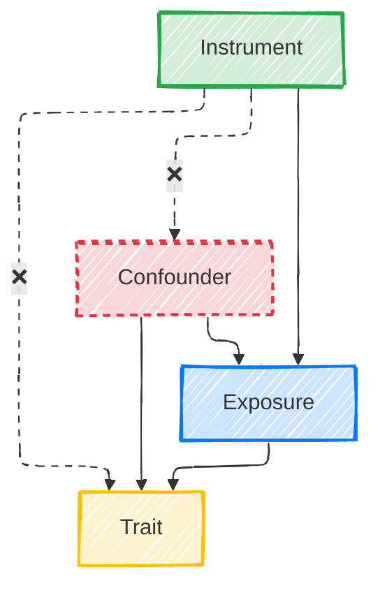

Randomized controlled trials (RCTs) are the gold standard to establish if an intervention **causes** an outcome. The magic lies in randomly assigning subjects to either the intervention or control group. A sufficiently large sample ensures any other confounding variables are evenly distributed. Thus, observed differences must be due to the intervention, and not to any other variables not under experimental control.

A key question in biology is whether and how an exposure, like the protein expression of a gene, causes a complex phenotype. However, using RCTs to study this issue would be quite challenging technically—and ethically abominable. Hence, we need to make do with _observational_ studies. Crucially, observational studies cannot directly prove causality, since they are plagued by biases, unknown confounders and reverse causality.

# Enter Mendelian Randomization

Interestingly, [genetic variants](https://en.wikipedia.org/wiki/Single-nucleotide_polymorphism) are akin to a randomized treatment when comparing siblings. Which allele each sibling gets is randomized at conception and fixed throughout life, making them unaffected by confounders. While there are exceptions ([linkage disequilibrium](https://en.wikipedia.org/wiki/Linkage_disequilibrium) and [population structure](<https://en.wikipedia.org/wiki/Population_structure_(genetics)>) to the former, and [canalization](<https://en.wikipedia.org/w/index.php?title=Canalization_(genetics)>) to the latter), when this assumption holds, we can indeed estimate causality. However, many observational studies are carried out in the general population, where the distribution of variants is not completely randomized. For instance, due to assortative mating, people with similar heritable phenotypes will tend to... mate. However, even in the general population and as long as [certain assumptions are met](#key-assumptions-and-how-to-verify-them) the distribution of SNPs mimics a random assignment. Mendelian Randomization (MR) exploits this fact to estimate the causal effect of an exposure on an outcome using genetic variants, often SNPs.

Remember: our goal is to precisely estimate the effect of an exposure on a trait. However, the presence of confounders that are either unobserved or difficult to measure makes this impossible. An instrument, such as a SNP in MR, is our way out of this: it is a variable that modifies the exposure and is not affected by the confounders. Or, more graphically:

Since there are no backdoor paths between the SNP and the outcome, any effect between them must occur through the exposure.

More formally, we aim to estimate the effect of an exposure $$X$$ on an outcome $$Y$$ using an instrument $$Z$$. $$Z$$ is a SNP. When SNPs are di-allelic, and since our focus is (diploid) humans, they can be encoded as a numerical variable containing the number of minor alleles of an individual: 0, 1 or 2. We'll also assume some potential confounders affecting both $$X$$ and $$Y$$. The most basic MR protocol assumes linearity, and consists of three steps:

1. Estimate the relationship between the instrument and the exposure by solving $$X = \beta_{ZX}Z + \varepsilon$$ via a [GWAS](https://en.wikipedia.org/wiki/Genome-wide_association_study). For instance, if the exposure is gene expression, we will conduct an eQTL study.
2. Use that model to estimate the exposure independent of potential confounders $$\tilde X = \beta_{ZX}Z$$
3. Estimate the relationship between this adjusted exposure and the outcome by solving $$Y = \beta_{\hat{X}Y} \hat{X} + \epsilon$$

The estimated causal effect, $$\beta_{\hat{X}Y}$$, is unconfounded!

Mathematically, this is usually performed via [two-stage least squares](https://mr-dictionary.mrcieu.ac.uk/term/tsls/). Alternatively, we can obtain $$\beta_{\hat{X}Y}$$ without computing it explicitly via the [Wald ratio estimator](https://mr-dictionary.mrcieu.ac.uk/term/wald-ratio/): $$\beta_{\hat{X}Y} = \frac {\beta_{ZY}} {\beta_{ZX}}$$. Note that the standard error of $$\beta_{\hat{X}Y}$$ also needs to be computed.

# Key assumptions and how to verify them

MR relies on three assumptions (_relevance_, _independence_ and _exclusion restriction_), described below. Other common, but optional, assumptions are _linearity_ and _homogeneity_ (the effect does not vary across strata in the population, like SNP levels or sex).

## Relevance

The instrument is _strongly_ associated with the exposure. When this assumption is violated, we say that the instrument is a weak instrument. The strength of this association can be measured using (Cragg-Donald) F-statistic:

$$
\left( \frac {n-m-1} {m} \right) \left( \frac {R^2} {1-R^2}\right)
$$

where $$n$$ is the number of samples, $$m$$ is the number of instruments, and $$R^2$$ is the instrument heritability. Conventionally, an instrument is considered _relevant_ when $$F > 10$$.

## Independence

The instrument is not associated with the outcome through a confounder, measured or not. Common violations include [assortative mating](https://mr-dictionary.mrcieu.ac.uk/term/assortative-mating/), [population structure](https://mr-dictionary.mrcieu.ac.uk/term/pop-strat/) and [dynastic effects](https://mr-dictionary.mrcieu.ac.uk/term/dynastic/). This is critical and it can only be assessed for the potential confounders that have been measured or can be estimated, by measuring the respective associations between those and the instrument and outcome.

## Exclusion restriction

The instrument is _exclusively_ associated to the outcome through the exposure. [(Horizontal) pleiotropy](https://mr-dictionary.mrcieu.ac.uk/term/horizontal-pleiotropy/) and linkage with other causal genes are common violations. When using multiple instruments, it can be assumed that they will all lead to the same estimate of the causal effect. Strong departures from this situation suggest that some instruments are affecting the outcome in different ways.

# Flavors of MR

[We just saw](#enter-mendelian-randomization) the simplest version of MR; but there are many algorithms to carry it out, depending on what data we have access to. I classify them here according to multiple criteria.

## Dataset

We can conduct MR with varying **numbers of datasets**. In _one-sample MR_, the instrument, exposure and outcome are measured on the same subjects. This is the case of the [two-stage least squares](#enter-mendelian-randomization) algorithm. In _two-sample MR_, the instrument-exposure relationship is measured on a set of samples, and the exposure-outcome on another one. One example is the Wald ratio estimate, which is the following statistic:

$$
W = \frac {\beta_{ZY}} {\beta_{ZX}}
$$

Typically, this is linked to the **granularity** of the data. One-sample MR is the ideal setting, since all the statistics are derived from the same dataset. This modality is easier when we have access to individual-level data. However, few datasets are rich enough to allow us to quantify effect sizes from the exposure and the outcome. A plethora of summary statistics are available in public repositories. For instance, we could measure the effect size of the instrument on gene expression on [GTEx](https://www.gtexportal.org), and on the outcome on a [publicly available GWAS](https://www.ebi.ac.uk/gwas/); this is called _two-sample MR_. As an attention note, all summary statistics need to come from ancestry-matched samples to preserve the [independence](#independence) assumptions.

## Instrument

The **choice of instrument** is a critical consideration. Instruments can range from a single SNP to multiple SNPs. A single SNP offers simplicity but is likely to have weak association with the exposure. While multiple SNPs can be a stronger instrument, they introduce challenges related to linkage disequilibrium and the need for conditional independence. In such a case, prior feature selection or dimensionality reduction techniques may be necessary to address these issues and ensure numerical stability. In the extreme case we could use a polygenic score (PGS), a weighted sum of multiple SNPs derived from a GWAS of the exposure, to capture a larger proportion of the variance in the exposure. Beware, though, of the potential biases lurking in the GWAS weights and the lingering effects of linkage disequilibrium.

The **location of the SNPs** can be relevant when examining molecular traits like gene expression. In _cis-MR_ we use SNPs located in the coding region of the target gene, or very nearby. This proximity dramatically boosts our confidence that the exclusion restriction assumption holds, as these SNPs are highly likely to affect gene expression directly. Alternatively, in _trans-MR_ SNPs can be located very far from the exposure gene, and hence [horizontal pleiotropy](#exclusion-restriction) can become an issue.

## Exposure

While I have focused on the case in which we deal with a single exposure (_univariable MR_), there are cases in which we use **multiple exposures** (_Multivariable MR_ or MVMR).

There are multiple **types of exposures**. Some can be relatively simple phenotypes close to the genetics, like gene expression. Others can be complex, like the body mass index. There are also many intermediate cases, like a protein's activity, or a biomarker that's affected by such activity via _vertical pleiotropy_.

# Example applications

| Goal                         | Exposure                                    | Instrument                               | MR Flavor                                 |
| ---------------------------- | ------------------------------------------- | ---------------------------------------- | ----------------------------------------- |
| Learn causes of a trait      | Simple or complex                           | One or multiple exposure-associated SNPs | Univariate MR                             |
| Characterize causal pathways | Multiple exposures, possibly with mediators | Independent SNPs for all exposures       | MVMR to model joint/mediated effects      |
| Find drug targets            | Protein activity or biomarker               | cis-pQTLs (preferred) or trans-pQTLs     | Cis-MR (preferred) or trans-MR            |
| Identify relevant tissues    | Tissue-specific gene expression             | eQTLs stratified by tissue               | Tissue-Specific MVMR to partition effects |

# References

- Hartley, A. E., Power, G. M., Sanderson, E., & Smith, G. D. (2022). [A Guide for Understanding and Designing Mendelian Randomization Studies in the Musculoskeletal Field](https://doi.org/10.1002/jbm4.10675). JBMR Plus (Vol. 6, Issue 10).
- Burgess, S., Mason, A. M., Grant, A. J., Slob, E. A. W., Gkatzionis, A., Zuber, V., Patel, A., Tian, H., Liu, C., Haynes, W. G., Hovingh, G. K., Knudsen, L. B., Whittaker, J. C., & Gill, D. (2023). [Using genetic association data to guide drug discovery and development: Review of methods and applications](https://doi.org/10.1016/j.ajhg.2022.12.017). The American Journal of Human Genetics (Vol. 110, Issue 2, pp. 195–214).
- Teumer, A. (2018). [Common Methods for Performing Mendelian Randomization](https://doi.org/10.3389/fcvm.2018.00051). Frontiers in Cardiovascular Medicine (Vol. 5).
- Holmes, M. V., Richardson, T. G., Ference, B. A., Davies, N. M., & Davey Smith, G. (2021). [Integrating genomics with biomarkers and therapeutic targets to invigorate cardiovascular drug development](https://doi.org/10.1038/s41569-020-00493-1). Nature Reviews Cardiology (Vol. 18, Issue 6, pp. 435–453). Springer Science and Business Media LLC.
- Sanderson, E. (2021). [Multivariable Mendelian Randomization and Mediation](https://doi.org/10.1101/cshperspect.a038984). Cold Spring Harbor Perspectives in Medicine (Vol. 11, Issue 2).
