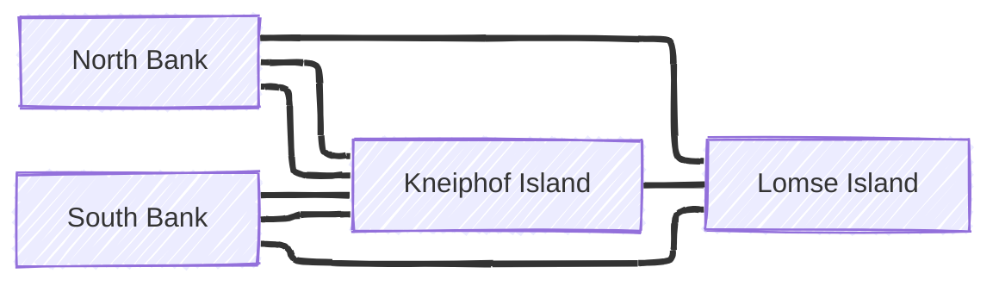

Graph theory was founded in the 18th century, with [Euler's](https://en.wikipedia.org/wiki/Leonhard_Euler) article on the [Seven Bridges of Königsberg problem](https://en.wikipedia.org/wiki/Seven_Bridges_of_K%C3%B6nigsberg). The city of Königsberg had seven bridges, connecting the north and south banks of the river and two fluvial islands (Kneiphof and Lomse). Back then, Königsberg looked roughly like this:

```mermaid
---
config:
  layout: elk
  look: handDrawn
---
graph LR
    N[North Bank]
    K[Kneiphof Island]
    L[Lomse Island]
    S[South Bank]

    N === K
    N === K
    N === L
    S === L
    S === K
    S === K
    K === L
```

The problem was to find a path around the city such that a walker would cross each bridge of the city exactly once. To solve this problem (by proving it had no solution), Euler found two useful abstraction: vertices representing land masses, and edges representing bridges.

In the 21st century, we define graphs as sets of objects (vertices) and pairwise relations between them (edges). Graphs are also known as networks; vertices as nodes; and edges as links. Königsberg is a graph with 4 vertices and 6 edges. Importantly, graphs are mathematical objects. A graph $$G$$ can be defined as

$$G = (V, E)$$

Where $$V$$ denotes the set of vertices and $$E$$ the set of edges (pairs of vertices).

> [!NOTE]  
> $$V$$ and $$E$$ above refer sets, specifically to the vertex and edge set of a specific graph ($$G$$). Note that they are in italics. In contrast, the $$\text{V}$$ in $$V(H)$$ and $$V(I)$$ refer to the vertex sets of graphs $$H$$ and $$I$$ respectively. Note that they are not in italics. I will follow the same convention elsewhere, e.g. when writing about [graph's matrices](../graphs-linear-algebra).

Sometimes, graphs are defined as triples $$G = (V, E, \phi)$$, which includes the incidence $$\phi$$ (mapping edges to pairs of vertices). This is to allow for [*multigraphs*](../graphs-glossary#multigraph), in which multiple edges between the same pair of vertices are allowed. Königsberg is an example of multigraph, since it has multiple bridges connecting the same landmasses (e.g., the North Bank and the Kneiphof Island). In this series we will ignore multigraphs and focus on [*simple*](../graphs-glossary#simple-graph) graphs, which have at most one edge between any pair of vertices and no loops. These graphs are important in real world applications to encode binary relations. This notation allows to concisely define multiple types of graph:

- Undirected graph: $$E \subseteq \{ \{u, v\} \| u, v \in V \}$$
- Directed graph: $$E \subseteq \{ (u, v) \| u, v \in V \}$$
- *Simple*, undirected graph: $$E \subseteq \{ \{u, v\} \| u, v \in V, u \neq v \}$$

The graph above is a simple undirected graph with $$V = \{1, 2, 3, 4 \}$$ and $$E = \{ \{1, 2\},  \{1, 3\}, \{1, 4\}, \{2, 3\} \}$$.

# Equivalence relations

A [mathematical equivalence](https://en.wikipedia.org/wiki/Equivalence_relation) is a binary relation that is reflexive, transitive and symmetric. It is noted like $\sim$ and formalizes the notion than objects can have a relationship of "sameness". The epitome of equivalence relation is "is equal to". For instance, $$2 = \frac 4 2 = \frac {2\pi} {\pi}$$. "Is greater than" is an example of non equivalence, since it does not meet the symmetric property (e.g., $$2 > 1$$ does not imply that $$1 > 2$$). Since edges in a graph also capture this notion of "sameness" in some sense, they are tighly connected to equivalences: $$u \sim v$$ implies that there is a [path](../graphs-glossary#path) between vertices $$u$$ and $$v$$. Equivalently, $$u$$ and $$v$$ are in the same [component](../graphs-glossary#component).