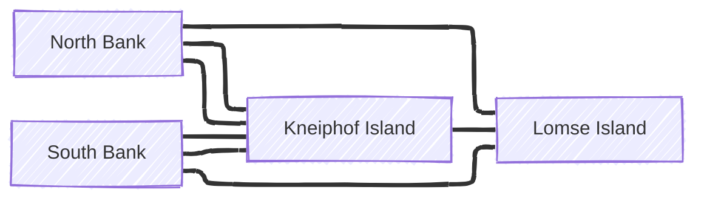

Graph theory was founded in the 18th century, with [Euler's](https://en.wikipedia.org/wiki/Leonhard_Euler) article on the [Seven Bridges of Königsberg problem](https://en.wikipedia.org/wiki/Seven_Bridges_of_K%C3%B6nigsberg). The city of Königsberg had seven bridges, connecting the north and south banks of the river, and two fluvial islands (Kneiphof and Lomse). Back then, Königsberg looked roughly like this:



The problem was to find a path such that a walker would cross each bridge exactly once. To solve this problem (by proving it had no solution), Euler found two useful abstractions: vertices representing land masses, and edges representing bridges. A key insight of framing the problem like this was that a graph can be represented in many ways (e.g., where to position the vertices), and all of them are equivalent. Euler's theorem (yes, one of them) is the first theorem in graph theory, and proves that a graph with a number of vertices with an odd [degree](#degree) other than 0 or 2 will have no [Euler circuits](#euler-circuit) and no [Euler trails](#euler-trail).

In the 21st century, we define graphs as sets of objects (vertices) and pairwise relations between them (edges). Graphs are also known as networks; vertices as nodes; and edges as links. Königsberg is a graph with 4 vertices and 6 edges. Importantly, graphs represent similarities between objects. In maths, **[equivalence](https://en.wikipedia.org/wiki/Equivalence_relation)** formalize the notion than objects can have a relationship of "sameness". An equivalence relation is a binary relation that is reflexive, transitive and symmetric. It is noted like $$\sim$$. The epitome of equivalence relation is "is equal to". For instance, $$2 = \frac 4 2 = \frac {2\pi} {\pi}$$. "Is greater than" is an example of non-equivalence, since it does not meet the symmetric property (e.g., $$2 > 1$$ does not imply that $$1 > 2$$). Since edges in a graph also capture this notion of "sameness" in some sense, they are tighly connected to equivalences: $$u \sim v$$ implies that there is a [path](#path) between vertices $$u$$ and $$v$$. Equivalently, $$u$$ and $$v$$ are in the same [component](#component).

Importantly, graphs are mathematical objects. A graph $$G$$ can be defined as

$$G = (V, E)$$

Where $$V$$ denotes the set of vertices and $$E$$ the set of edges (pairs of vertices).

> **_Notation note:_** $$V$$ and $$E$$ above refer sets, specifically to the vertex and edge set of a specific graph ($$G$$). Note that they are in italics. In contrast, the $$\text{V}$$ in $$\text{V}(H)$$ and $$\text{V}(I)$$ refer to the vertex sets of graphs $$H$$ and $$I$$ respectively. Note that they are not in italics. I will follow the same convention elsewhere, e.g. when writing about [graph's matrices]().

This notation allows to concisely define multiple types of graph:

- Undirected graph: $$E \subseteq \{ \{u, v\} \mid u, v \in V \}$$, i.e., the edges do not have directions.

  ```mermaid
  ---
  config:
  layout: elk
  look: handDrawn
  ---
  graph LR

      vertex_a((a))
      vertex_b((b))
      vertex_c((c))

      vertex_a === vertex_b
      vertex_a === vertex_c
      vertex_b === vertex_c
  ```

- Directed graphs: $$E \subseteq \{ (u, v) \mid u, v \in V \}$$, i.e., the edges have directions.

  ```mermaid
  ---
  config:
  layout: elk
  look: handDrawn
  ---
  graph LR

      vertex_a((a))
      vertex_b((b))
      vertex_c((c))

      vertex_a --> vertex_b
      vertex_a --> vertex_c
      vertex_b --> vertex_c
  ```

Sometimes, graphs are defined as triples. An example are [**multigraphs**](#multigraph), graphs in which multiple edges between the same pair of vertices are allowed. They are triples $$G = (V, E, \phi)$$ in which the incidence function $$\phi$$ represents the mapping from edges to pairs of vertices. Königsberg is an example of multigraph, since it has multiple bridges connecting the same landmasses (e.g., the North Bank and the Kneiphof Island). For instance, the Königsberg graph is an undirected multigraph with:

$$V = \{N, K, L, S \}$$

$$E = \{ e_1, e_2, e_3, e_4, e_5, e_6, e_7 \}$$

$$
\phi(x) = \begin{cases}
  \{ N, K \} & \text{if $x = e_1$} \\
  \{ N, K \} & \text{if $x = e_2$} \\
  \{ N, L \} & \text{if $x = e_3$} \\
  \{ S, L \} & \text{if $x = e_4$} \\
  \{ S, K \} & \text{if $x = e_5$} \\
  \{ S, K \} & \text{if $x = e_6$} \\
  \{ K, L \} & \text{if $x = e_7$} \\
  \end{cases}
$$

Another type of graph that requires a triple are **weighted** graphs, in which each edge has a weight. They are triples $$G = (V, E, w)$$ in which $$w$$ is a function that maps edges to their weights. Note that weighted multigraph would be a quadruple, since it would require both an incidence and a weight functions.

> **Note:** unless specified otherwise, in this series I will focus on [_simple_](#simple-graph) graphs, which have at most one edge between any pair of vertices and no loops.

# Further reading

- [An introduction to graph theory](https://arxiv.org/abs/2308.04512)
