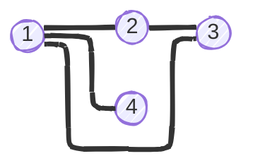

In this article I discuss matrices associated to graphs. As we will see, a graph can be represented as a matrix without any information loss. Hence, the properties of these matrices describe [properties of the underlying graph](../graphs-basics#properties-of-a-graph).

# Matrices associated to graphs

A graph $$G = (V, E)$$ s.t. $$V = \{v_1, \dots, v_n\}$$ and $$E = \{e_1, \dots, e_m \}$$ has several important associated matrices. For convenience, I often refer to vertex $$v_i$$ simply by its index ($$i$$), and to an edge by the vertices it links (e.g., $$ij$$).

I will show examples on the following graph, named $$G_1$$:




## Degree matrix

[Vertex degree](../graphs-basics#degree) is ised to define the **degree** matrix $$D$$ is a diagonal $$n \times n$$ matrix such that $$D_{ii} = \deg i$$, and 0 elsewhere. For instance, for $$G_1$$:

$$
\text{D}(G_1) = \begin{bmatrix}
3 & 0 & 0 & 0 \\
0 & 2 & 0 & 0 \\
0 & 0 & 2 & 0 \\
0 & 0 & 0 & 1 \\
\end{bmatrix}
$$

## Incidence matrix

[Incidence](../graphs-glossary#incidence) is used to define the **incidence** matrix $$Q$$, a $$n \times m$$ matrix such that $$Q_{ij}$$ equals:

- If $$G$$ is *directed*:
    - $$0$$ if vertex $$i$$ and edge $$e_j$$ are not incident
    - $$1$$ if edge $$e_j$$ originates at vertex $$i$$
    - $$-1$$ if edge $$e_j$$ terminates at vertex $$i$$
- If $$G$$ is *undirected*:
    - If $$Q$$ is *unoriented*:
        - $$0$$ if vertex $$i$$ and edge $$e_j$$ are not incident
        - $$1$$ otherwise
    - If $$Q$$ is *oriented*: we pick an [orientation](../graphs-glossary#orientation) of the graph, and use the incidence matrix of the resulting directed graph.

## Adjacency matrix

[Adjacency](../graphs-glossary#adjacency) is used to define the **adjacency** matrix $$A$$, a matrix $$n \times n$$ such that the $$A_{ij}$$ equals:

- $$0$$ if vertices $$i$$ and $$j$$ are not adjacent (note that in simple graphs vertices are not self-adjacent)
- $$1$$ otherwise

For $$G_1$$:

$$
A = \begin{bmatrix}
0 & 1 & 1 & 1 \\
1 & 0 & 1 & 0 \\
1 & 1 & 0 & 0 \\
1 & 0 & 0 & 0 \\
\end{bmatrix}
$$

The adjacency matrix relates to the concept of [**paths**](../graphs-glossary#path) in an unweighted graph: $$(A^k)_{ij}$$ represents the number of paths of length $$k$$ from vertex $$i$$ to vertex $$j$$. In a weighted graph, it represents the sum of products of weights. For instance, if edge weights represent transition probabilities, $$(A^k)_{ij}$$ represents the probability of starting a walk at node $$i$$ and ending at node $$j$$ after $$k$$ steps.

The adjacency matrix has some important properties:

- If $$G$$ is undirected, $$A$$ is symmetric

## Laplacian matrix

The **Laplacian** matrix $$L$$ is a $$n \times n$$ matrix such that the $$L_{ij}$$ equals::

- For $$i \neq j$$:
    - $$0$$ if vertex $$i$$ and edge $$j$$ are not adjacent
    - $$-1$$ otherwise
- For $$i = j$$, the degree of $$i$$.

More concisely, $$L = D - A$$. Or, given any oriented incidence matrix $$Q(G)$$, $$L = QQ^T$$.

For $$G_1$$:

$$
L = D - A = \begin{bmatrix}
3 & -1 & -1 & -1 \\
-1 & 2 & -1 & 0 \\
-1 & -1 & 2 & 0 \\
-1 & 0 & 0 & 1 \\
\end{bmatrix}
$$

The Laplacian relates to the connectedness of a graph, giving rise to [spectral graph theory](#spectral-graph-theory). It also is connected to [*flows*](../graphs-glossary#flow). The diagonal entries represent the total outflow capacity from a vertex, while off-diagonal entries encode pairwise connection strengths.

The Laplacian matrix has some important properties:

- If $$G$$ is undirected, $$L$$ is symmetric and positive semi-definite.
- $$L$$ has $$n$$ non-negative, real-valued eigenvalues.

## Normalized Laplacian matrices

$$L_\text{sym}$$ is a symmetric matrix derived from $$L$$ as follows:

$$L_\text{sym} = D^{-1/2}LD^{-1/2}$$

$$L_\text{rw}$$ is a matrix closely related to random walks that is derived from $$L$$ as follows:

$$L_\text{rw} = D^{-1}L$$

# Spectral graph theory

**Spectral graph theory** study how the eigenvalues and eigenvectors of a graph's associated matrices relate to its properties. Specifically, the eigenvalues of the Laplacian are closely related to the connectivity of the associated graph.

## Number of connected components

A simple, but ultimately insightful property of $$L$$ is that, for an undirected graph, the sum over the rows or the columns equals 0. In other words, multiplying $$L$$ by an all-ones vector $$\mathbf{1}$$ results in the zero vector. This tells us that $$L$$ has an eigenvalue of 0, corresponding to the eigenvector $$\mathbf{1}$$. Separately, linear algebra tells us that since $$L$$ is real and symmetric, it has *real* eigenvalues and *orthogonal* eigenvectors. And since $$L$$ is positive semi-definite, its eigenvalues are *non-negative*. As we have just seen, the [first eigenvalue](../graphs-glossary#first-k-eigenvectors), $$\lambda_1$$, of $$L$$ is 0, corresponding to the $$\mathbf{1}$$ eigenvector. If a vector has multiple [components](../graphs-glossary#component), $$L$$ is block diagonal. This makes it easy to see that the indicator vectors, representing the membership of each vertex to one of the components, are eigenvectors with an eigenvalue of 0. This highlights another important property of the Laplacian: given an undirected graph, the multiplicity of the eigenvalue 0 of $$L$$ equals the number of [components](../graphs-glossary#component). Conversely, for a [connected](../graphs-glossary#connected-graph) graph, $$\lambda_2 > 0$$. (The second smallest eigenvalue is sometimes called the Fiedler eigenvalue.)

## Spectral clustering

The goal of **spectral clustering** is finding a partition of the graph into $$k$$ groups such that the are densely/strongly connected with each other, and sparsely/weakly connected to the others. (If we consider [random walks](#random-walks-and-markov-chains), spectral clustering seeks a partition of the graph such that a random walker tends to stay within each partition, rarely shifting between disjoint sets.) An spectral clustering algorithm, in which seek to find *k* clusters, looks as follows:

```pseudocode
\begin{algorithm}
\caption{Spectral Clustering}
\begin{algorithmic}[1]
\PROCEDURE{GraphSpectralClustering}{$$A, k$$}
    \STATE $$n \gets \text{number of nodes (rows in A)}$$
    
    \STATE Compute degree matrix $$D$$ where $$D[i,i] = \sum_{j=1}^n A[i,j]$$
    \STATE $$D_{\text{sqrt-inv}} \gets \text{diag}(1/\sqrt{D[i,i]})$$
    \STATE $$L_{\text{sym}} \gets I - D_{\text{sqrt-inv}} A D_{\text{sqrt-inv}}$$ \COMMENT{Symmetric normalized Laplacian}
    
    \STATE Compute first $$k$$ eigenvectors $$u_1, \ldots, u_k$$ of $$L_{\text{sym}}$$
    \STATE Form matrix $$U \in \mathbb{R}^{n \times k}$$ with columns $$u_1, \ldots, u_k$$
    
    \FOR{$$i = 1$$ \TO $$n$$}
        \STATE $$U[i] \gets U[i] / \|U[i]\|$$ \COMMENT{Row normalization}
    \ENDFOR
    
    \STATE $$\text{labels} \gets \text{KMeans}(U, k)$$ \COMMENT{Cluster embedded nodes}
    \RETURN $$\text{labels}$$
\ENDPROCEDURE
\end{algorithmic}
\end{algorithm}
```

> **Note:** spectral clustering is often applied as a clustering technique on datasets. The aim is to divide the observation into $$k$$ groups based on their pairwise similarities. In that case, the first step consists on obtaining the graph. It will be a complete weighted graph in which the vertices are the different observations and the edges are weighted according to the similarity between each pair of vertices, as measured by an arbitrary function.

## Graph partitioning

TODO

# Graph Fourier Transform

TODO

# Further reading

- [A Tutorial on Spectral Clustering](https://people.csail.mit.edu/dsontag/courses/ml14/notes/Luxburg07_tutorial_spectral_clustering.pdf)
- [Four graph partitioning algorithms](https://mathweb.ucsd.edu/~fan/talks/mlg.pdf)