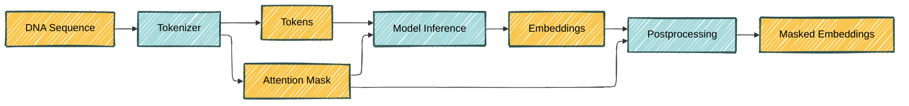

When working with large transformer models programatically, different public models are stored in different formats, have different interfaces, are implemented in different backends, etc. Migrating from one to another can be a real pain. That's the problem that Hugging Face 🤗 and its [`transformers`](https://huggingface.co/docs/transformers/index) Python library aim to solve. `transformers` provides a unified API to fetch, use and fine-tune many models, making it easy to switch between them without having to learn a new API each time, which has turned it into a staple of LLM work.

Let's dive into the `transformers` library. Although big tech is going crazy over LLMs, DNA language models are where the money is.<d-footnote>Citation required</d-footnote> In this post, I use `transformers` to showcase an application of the [Nucleotide Transformer](https://www.nature.com/articles/s41592-024-02523-z) (NT), a DNA language model. And I use the NT to showcase `transformers`.

I will be providing snippets of code along with the text. If you are still curious about the nitty-gritty, all the code is available [on Github](https://github.com/hclimente/hclimente.github.io/blob/main/assets/python/2025-05-02-hf-transformers/supplementary.ipynb).

<!-- https://colab.research.google.com/github/hclimente/hclimente.github.io/blob/main/assets/python/2025-05-02-hf-transformers/main.ipynb -->

# A worked-out training example

The [Nucleotide Transformer](https://www.nature.com/articles/s41592-024-02523-z) (NT) was developed by [InstaDeep](https://www.instadeep.com/). It's an encoder-only transformer, essentially a [BERT model](<https://en.wikipedia.org/wiki/BERT_(language_model)>) trained on the genomes of 850 species via masked language modelling (MLM). The figure below gives the basic idea.



<div class="caption">
    Training of the NT using masked language modelling (MLM). Adapted from Figure 1 in the <a href="https://www.nature.com/articles/s41592-024-02523-z">NT article</a>.
</div>

Let's walk through the process using a random DNA sequence: `ATGGTAGCTACATCATCT`. In short, a fraction of the input DNA sequence is hidden from the model. The task of the model is to retrieve the masked subsequences using the rest of the sequence. For instance, the model could receive as input `ATGGTAGCTACA<MASK>` and we expect it to correctly guess that `<MASK>` equals `TCATCT`.

1. **Tokenizer:** First, we convert the input DNA sequence into a sequence of integers (_tokens_), each representing a subsequence of length 6 nucleotides ("6-mers"). The total number of tokens is 4,107: one for each of the $$4^6 = 4096$$ possible 6-mers and 11 special tokens ([CLS](https://en.wikipedia.org/wiki/Sentence_embedding), MASK, PAD and a few others). (You can learn more about the tokenizer in the [supplementary notes](https://github.com/hclimente/hclimente.github.io/blob/main/assets/python/2025-05-02-hf-transformers/supplementary.ipynb).) The tokenizer transforms our 18-nucleotide sequence into a tokenized sequence of length 4: `[3, 506, 3662, 1567]`. This includes the CLS token (`3`) and three tokens representing three 6-mers. During training, a random subset of 15% of the tokens are replaced by the MASK token (`2`). These are the parts of the sequence that the model will try to recover. Let's mask the last token in our example: `[3, 506, 3662, 2]`.

2. **Embedding layer:** Afterwards, an embedding layer transforms the tokenized sequence of integers into an fixed-length vector of real values (_embedding_). On this embedding, a positional encoding is added.

3. **Transformer encoder:** Then comes the main event: the stacked Transformer encoder blocks (since the NT is an encoder-only model, remember?). These blocks are where the magic actually happens, processing the initial embeddings to create context-aware representations. Each block uses self-attention mechanisms to let tokens interact across the sequence and feed-forward networks for position-specific processing.

4. **Token probabilities:** Last, the last layer's embedding is transformed into a probability of each token in each of the input positions. Since there were 3 input positions and 4,107 possible tokens, the output for our sequence will be a matrix of size 3 × 4,107. The rows will sum to 1. The masked token was `1567` and was in the last position. If our model has done a good job, the matrix entry (3, 1567) will be close to 1, and the rest of the entries in that row will be close to 0. During training, the trainer evaluates this output using the [cross-entropy](https://en.wikipedia.org/wiki/Cross-entropy) loss, and adjusts the parameters of the model by [backpropagation](https://en.wikipedia.org/wiki/Backpropagation).

This is technically how the model learns to guess the hidden sequence from it's genomic context. But, what is it _really_ learning? My intuition is that it's picking up general patterns across genomes. For instance, it might learn to recognize a pattern that we would adscribe to an alpha helix. By putting together some of such patterns, it might group together sequences that we would call protein coding. Then, it would leverage this knowledge in the MLM task to predict a sequence that preserves the alpha helix with the observed codon usage. Similearly, it might learn that another mask is around the right genomic distance from an ORF, and deduce it should predict what we recognize as a promoter. In all this proess the NT has no access to phenotypic information or explicit knowledge about promoters, genes or alpha helices. It is flying blind regarding how this DNA sequence plays out in the real world. Although it is getting a glimpse of evolutionary constraints by being exposed to different genomes, it won't be able to learn sophisticated genomic regulation patterns.

# Loading a pre-trained model

Two elements of the Hugging Face ecosystem vastly facilitate sharing and leveraging pre-trained models.

One is the [Model Hub](https://huggingface.co/docs/hub/en/index), a repository for the community to share and discover pre-trained models. In this post I use the smallest NT, [a 50 million parameter model](https://huggingface.co/InstaDeepAI/nucleotide-transformer-v2-50m-multi-species), which InstaDeep made available from [their hub organization](https://huggingface.co/InstaDeepAI).

The other one is the many [`transformers` AutoClasses](https://huggingface.co/docs/transformers/model_doc/auto). They abstract away the specific model architecture, and the changes that would be needed to make it fit our desired use-case. For instance, fetching the NT adapted for masked language modeling is as easy as running:

```python
model = AutoModelForMaskedLM.from_pretrained(
  "InstaDeepAI/nucleotide-transformer-v2-50m-multi-species",
  trust_remote_code=True
)

print(model)
```

```
...
    (layer_norm): LayerNorm((512,), eps=1e-12, elementwise_affine=True)
    (decoder): Linear(in_features=512, out_features=4107, bias=False)
  )
)
```

As expected, the output is a vector of length 4,107, one for each possible token.

By using the `from_pretrained` method, we are loading both the architecture and the weights of the model. By default, the model is set in evaluation mode; if we were to further fine-tune it, we would need to set it to training mode using `model.train()`. In contrast, we could use `from_config` to load the model architecture only. This would be appropriate to train the model from scratch.

If we wanted to leverage the pre-trained model for binary classification, we would run instead:

```python
model = AutoModelForSequenceClassification.from_pretrained(
    "InstaDeepAI/nucleotide-transformer-v2-50m-multi-species",
    num_labels=2,
    trust_remote_code=True
)

print(model)
```

```
...
    (dropout): Dropout(p=0.0, inplace=False)
    (out_proj): Linear(in_features=512, out_features=2, bias=True)
  )
)
```

As we can see, this added a (disabled) dropout layer, and a linear layer with two outputs, as requested.

The model cannot be applied directly to a DNA sequence, which needs to be [tokenized first](#a-worked-out-training-example). The [AutoTokenizer](https://huggingface.co/docs/transformers/model_doc/auto#transformers.AutoTokenizer) has got our back:

```python
tokenizer = AutoTokenizer.from_pretrained(
  "InstaDeepAI/nucleotide-transformer-v2-50m-multi-species",
  trust_remote_code=True
)
```

# Building an inference pipeline

The NT's [Model Card](https://huggingface.co/InstaDeepAI/nucleotide-transformer-v2-50m-multi-species) shows how to embed DNA sequences:

```python
from transformers import AutoTokenizer, AutoModelForMaskedLM
import torch

# Import the tokenizer and the model
tokenizer = AutoTokenizer.from_pretrained(
    "InstaDeepAI/nucleotide-transformer-v2-50m-multi-species",
    trust_remote_code=True
    )
model = AutoModelForMaskedLM.from_pretrained(
    "InstaDeepAI/nucleotide-transformer-v2-50m-multi-species",
    trust_remote_code=True
    )

# Choose the length to which the input sequences are padded. By default, the
# model max length is chosen, but feel free to decrease it as the time taken to
# obtain the embeddings increases significantly with it.
max_length = tokenizer.model_max_length

# Create a dummy dna sequence and tokenize it
sequences = ["ATGGTAGCTACATCATCT"]
tokens_ids = tokenizer.batch_encode_plus(
    sequences,
    return_tensors="pt",
    padding="max_length",
    max_length = max_length)["input_ids"]

# Compute the embeddings
attention_mask = tokens_ids != tokenizer.pad_token_id
torch_outs = model(
    tokens_ids,
    attention_mask=attention_mask,
    encoder_attention_mask=attention_mask,
    output_hidden_states=True
)

# Compute sequences embeddings
embeddings = torch_outs['hidden_states'][-1].detach().numpy()
print(f"Embeddings shape: {embeddings.shape}")
print(f"Embeddings per token: {embeddings}")

# Add embed dimension axis
attention_mask = torch.unsqueeze(attention_mask, dim=-1)

# Compute mean embeddings per sequence
mean_sequence_embeddings = torch.sum(attention_mask*embeddings, axis=-2)/torch.sum(attention_mask, axis=1)
print(f"Mean sequence embeddings: {mean_sequence_embeddings}")

```

This is a representation of a common workflow in inference, which looks like this:



[Hugging Face's `pipelines`](https://huggingface.co/docs/transformers/pipeline_tutorial) exist to encapsulate these inference steps while cutting the boilerplate code.



```python
from transformers import Pipeline

class DNAEmbeddingPipeline(Pipeline):

    def _sanitize_parameters(
        self,
        **kwargs,
    ) -> Tuple[Dict[str, Any], Dict[str, Any], Dict[str, Any]]:
        """
        Sanitize the parameters for the pipeline.

        Args:
            **kwargs: The parameters to be sanitized.

        Returns:
            Tuple[Dict[str, Any], Dict[str, Any], Dict[str, Any]]: A tuple containing
                the sanitized parameters for preprocessing, model forward pass, and
                postprocessing, respectively.
        """
        preprocess_params = {}

        recognized_params = set(["max_length"])

        if "max_length" in kwargs:
            preprocess_params["max_length"] = kwargs["max_length"]

        unrecognized_params = set(kwargs.keys()) - recognized_params
        if unrecognized_params:
            raise ValueError(f"Unrecognized pipeline parameters: {unrecognized_params}")

        return preprocess_params, {}, {}

    def preprocess(
        self,
        model_inputs: Union[str, List[str]],
        max_length: Optional[int] = None,
    ) -> List[pt.Tensor]:
        """
        Preprocess the input sequences before passing them to the model.

        Args:
            model_inputs (Union[str, List[str]]): The input sequence(s) to be tokenized.
            max_length (Optional[int]): The maximum length of the tokenized sequences.
                If None, the maximum length of the tokenizer is used.

        Returns:
            List[pt.Tensor]: The tokenized input sequences.
        """
        if max_length is None:
            max_length = self.tokenizer.model_max_length

        if isinstance(model_inputs, str):
            model_inputs = [model_inputs]

        tokens_ids = self.tokenizer.batch_encode_plus(
            model_inputs,
            return_tensors="pt",
            padding="longest",
            max_length=max_length,
            truncation=True,
        )["input_ids"]

        return tokens_ids

    def _forward(
        self,
        model_inputs: pt.Tensor,
    ) -> Dict[str, Any]:
        """
        Forward pass through the model.

        Args:
            model_inputs (pt.Tensor): The tokenized input sequence(s).

        Returns:
            Dict[str, Any]: The model outputs.
        """
        # find out which of the tokens are padding tokens
        # these tokens will be ignored by the model
        attention_mask = model_inputs != self.tokenizer.pad_token_id

        out = self.model(
            model_inputs,
            attention_mask=attention_mask,
            encoder_attention_mask=attention_mask,
            output_hidden_states=True,
        )

        out["attention_mask"] = attention_mask

        return out

    def postprocess(
        self,
        model_outputs: Dict[str, Any],
    ) -> dict[str, np.ndarray]:
        """
        Compute the mean sequence embedding from the last hidden layer (size 512).

        Args:
            model_outputs (Dict[str, Any]): The model outputs.

        Returns:
            dict[str, np.ndarray]: The mean sequence embeddings for each input sequence.
        """
        embeddings = model_outputs["hidden_states"][-1].detach()
        attention_mask = model_outputs["attention_mask"].unsqueeze(-1).cpu()
        masked_embeddings = attention_mask * embeddings

        mean_sequence_embeddings = masked_embeddings.sum(1) / attention_mask.sum(1)

        return mean_sequence_embeddings.cpu().numpy()
```



Once the pipeline is in place, embedding a sequence is as easy as:

```python
tokenizer = AutoTokenizer.from_pretrained(
    "InstaDeepAI/nucleotide-transformer-v2-50m-multi-species",
    trust_remote_code=True,
)
model = AutoModelForMaskedLM.from_pretrained(
    "InstaDeepAI/nucleotide-transformer-v2-50m-multi-species",
    trust_remote_code=True,
)

pipeline = DNAEmbeddingPipeline(model=model, tokenizer=tokenizer)
embedding = pipeline("ATGGTAGCTACATCATCTG")
```

Encapsulating the model into its own inference pipeline has a few advantages. Beyond the obvious benefit of cleaner code by separating inference steps into logical abstractions, it makes swapping models a breeze, as you'll see when we [fine-tune the model](#fine-tuning-the-model).



The attention mask is a binary mask that, for a given input sequence, identifies the padding tokens that are there just to make the sequence fit the desired shape. They help the model avoid wasting (C/G/T)PU cycles on processing useless information. Or even worse, learning the wrong information, when we are not in inference mode. This mask is passed along through the model, and forces the attention scores for these padding tokens to effectively become zero.



# Embedding DNA sequences

I will be using the NT to embed protein-coding DNA sequences from six species: three animals (human, mouse and fruit fly); one plant (arabidopsis); one bacteria (_E. coli_); and one yeast (_S. cerevisae_). I aim to obtain embeddings such that the sequences from each species are on aggregate closer to each other than to the sequences from other species.

To this end, I downloaded the DNA sequences of all protein coding genes for the selected species. For each species I randomly subsampled 2,000 sequences of 60 nucleotides each. I chose the length of the sequence because of convenience: they are a common sequence length for FASTA files, and short enough for my home computer to handle. Half of them were the train set, used for model building; the other half constituted the test set, used exclusively for performance evaluation. I will only show results on the latter.

I embedded the sequences (code available [here](https://github.com/hclimente/hclimente.github.io/blob/main/assets/python/2025-05-02-hf-transformers/main.py)) and used a UMAP to visualize the embeddings:

<div class="l-page">
    <iframe src="{{ '/assets/python/2025-05-02-hf-transformers/plotly/umap_embeddings.html' | relative_url }}" frameborder='0' scrolling='no' height="500px" width="100%" style="border: 1px dashed grey;"></iframe>
</div>

<div class="caption">
    Scatter plot of the two UMAP dimensions from the embeddings computed by applying the <em>pre-trained</em> NT to the 6,000 DNA sequences test dataset, containing 1,000 sequences from each species.
</div>

Some disclaimers need to be made. First, I took a minuscule sample of all protein coding sequences, which is somewhat biased towards the beginning of the protein. Second, I am using the smallest NT, and its likely that larger models can represent these sequences more richly.

Even with these limitations, sequences from the same species tend to inhabit similar regions of the underlying manifold. If you are unconvinced, just squint your eyes. This is probably not too reassuring, so maybe I can do better: I trained a muticlass logistic regression tasked with predicting the species using only the embeddings. This classifier achieved an accuracy of $$0.47$$, convincingly above the accuracy of a random classifier ($$\frac 1 6 = 0.16$$). Furthermore, some of the errors are clearly between the two closest species from an evolutionary standpoint: human and mouse.



# Fine-tuning the model

The NT was trained via self-supervised learning, and it never got any explicit knowledge about which species it was looking at. Hence, it's not too surprising that it can't separate different species right off the bat. Fine-tuning it to this task should provide more relevant representations. `transformers` also provides an easy way of doing that using `transformers.Trainer`. (For the record, I am unconvinced this is a better solution than [Lightning](https://lightning.ai) and others; however, it can be convenient.)

We will start by importing the model using a different AutoClass which will automatically add a classification head:

```python
classif_nt = AutoModelForSequenceClassification.from_pretrained(
    "InstaDeepAI/nucleotide-transformer-v2-50m-multi-species",
    num_labels=6,
    trust_remote_code=True
)
```

The `Trainer` makes fine-tuning the model quite easy. The task is to predict the species from the sequence. I froze the first few layers from the NT, which should capture low level features of the sequences, and will only train the last layers. Then, I specify the trainer configuration:

```python
training_args = TrainingArguments(
    per_device_train_batch_size=64,
    per_device_eval_batch_size=64,
    num_train_epochs=10,
    eval_strategy="epoch",
    save_strategy="epoch",
    load_best_model_at_end=True,
    metric_for_best_model="accuracy",
    seed=42,
    dataloader_pin_memory=False,  # not supported by mps
)
data_collator = DataCollatorWithPadding(tokenizer=tokenizer_nt)

trainer = Trainer(
    model=classif_nt,
    args=training_args,
    train_dataset=tr_train_ds,    # train on 90% of the train set
    eval_dataset=tr_val_ds,       # evaluate on 10% of the train set
    data_collator=data_collator,
    compute_metrics=compute_trainer_metrics,
)
```

Last, I just begin training with:

```python
trainer.train()
```

After the model is trained, as specified in the trainer arguments, the model with the best performance on the validation dataset will be the loaded.

We can create a new inference pipeline focus around classification. The pipeline will output both the probability of each class, as well as the embeddings, obtained from the last layer. Since this model is tasked explicitly with telling apart sequences coming from different species, the embedding should provides a much better separation:

<div class="l-page">
    <iframe src="{{ '/assets/python/2025-05-02-hf-transformers/plotly/umap_embeddings_ft-model.html' | relative_url }}" frameborder='0' scrolling='no' height="500px" width="100%" style="border: 1px dashed grey;"></iframe>
</div>

<div class="caption">
    Scatter plot of the two UMAP dimensions from the embeddings computed by applying the <em>fine-tuned</em> NT to the 6,000 DNA sequences test dataset, containing 1,000 sequences from each species.
</div>

Maybe this time you won't even need to squint your eyes to agree.

# Conclusions

In this post, I have given a primer on how to use Hugging Face's libraries for a particular flavor of BioML work. Yet, in my opinion, Hugging Face's greatest strength lies just in the boundaries of this post's focus: on its community. With its [Model Hub](https://huggingface.co/docs/hub/en/models-the-hub) they have made it easy for researchers to quickly prototype and share models, and to build on top of existing ones.
