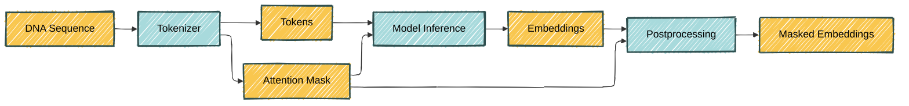

Hugging Face 🤗 has become a staple of LLM work. In this post I will explore this library with a different use case: handling genomics language models.

TODO What is inference

[Hugging Face's `transformers`](https://huggingface.co/docs/transformers/index) is a powerful library for working with transformer models, providing a wide range of pre-trained models and utilities for fine-tuning and deploying them. Problem that is solved: different models have different APIs. The `transformers` library provides a unified API for all transformer models, making it easy to switch between them without having to learn a new API each time.

In this post, I use `transformers` to showcase the [Nucleotide Transformer](https://www.nature.com/articles/s41592-024-02523-z) (NT), a DNA large language model. And I use the NT to showcase `transformers`.

As always, the code is available in the repo. I will be showing snippets for illustration purposes, but skipping important bits, like the imports.

<!-- https://colab.research.google.com/github/hclimente/hclimente.github.io/blob/main/assets/python/2025-05-02-hf-transformers/main.ipynb -->

# The Nucleotide Transformer

The [Nucleotide Transformer](https://www.nature.com/articles/s41592-024-02523-z) (NT) was developed by [InstaDeep](https://www.instadeep.com/). The NT is an encoder-only transformer, and was in fact trained as a [BERT](<https://en.wikipedia.org/wiki/BERT_(language_model)>) via masked language modelling (MLM). This is shown in the figure below and fleshing out just below. In short, a fraction of the input DNA sequence is hidden from the model. The task of the model is to retrieve the masked subsequences using the rest of the sequence. The whole genome of 850 species was used in training.



<div class="caption">
  Training of the NT using masked language modelling (MLM). Adapted from Figure 1 in the <a href="https://www.nature.com/articles/s41592-024-02523-z">NT article</a>.
</div>

## A worked-out training example

Let's see this process in detail using a random sequence of 18 nucleotides: `ATGGTAGCTACATCATCT`

First, a **tokenization** layer converts the input DNA sequence into a sequence of integers, each representing a subsequence of length 6 nucleotides ("6-mers"). There are $$4^6 = 4096$$ possible 6-mers, which will require the same number of tokens. There are eight additional tokens: one for each possible input nucleotide (A, T, C, G and N), one for the padding (PAD), one for the mask (MASK) and one for the entire sequence ([CLS](https://en.wikipedia.org/wiki/Sentence_embedding)). In total, there are 4,104 tokens; each will be represented by an integer. The tokenizer transforms our 18-nucleotide sequence into a tokenized sequence of length 4: `[3, 506, 3662, 1567]`. This includes the CLS token (3) and three tokens representing three 6-mers. You can learn more about the tokenizer in the [supplementary notes](https://github.com/hclimente/hclimente.github.io/blob/main/assets/python/2025-05-02-hf-transformers/supplementary.ipynb).

During training, a random subset of 15% of the tokens are replaced by the MASK token. These are the parts of the sequence that the model will try to recover. Let's mask the last token in our example: `[3, 506, 3662, 2]`.

Afterwards, an **embeddeding** layer transforms the tokenized sequence of integers into an fixed-length vector of real values (_embedding_). On this embedding, a positional encoding is added. Rotary embeddings are used.

Then, ...

Last, the embedding produced by the final layer is transformed into the probability of each token in each of the input positions. Since there were 3 input positions and 4,104 possible tokens, the output for our sequence will be a matrix of size 3 × 4,104. The masked token was 1567 and was in the last position. If our model has done a good job, the matrix entry (3, 1567) will be close to 1, and the rest of the entries in that row will be close to 0. During training, the trainer evaluates this output using the [cross-entropy](https://en.wikipedia.org/wiki/Cross-entropy) loss, and adjusts the parameters of the model by [backpropagation](https://en.wikipedia.org/wiki/Backpropagation).

# Loading a pre-trained model

Two elements of the Hugging Face ecosystem vastly facilitate sharing and leveraging pre-trained models.

One is the [Model Hub](https://huggingface.co/docs/hub/en/index), a repository for the community to share and discover pre-trained models. In this post I use the smallest NT, [a 50 million parameter model](https://huggingface.co/InstaDeepAI/nucleotide-transformer-v2-50m-multi-species), which InstaDeep made available from [their hub organization](https://huggingface.co/InstaDeepAI).

The other one is the many [`transformers` AutoClasses](https://huggingface.co/docs/transformers/model_doc/auto).
TODO Elaborate

For instance, fetching the NT adapted for masked language modeling is as easy as running:

```python
model = AutoModelForMaskedLM.from_pretrained(
  "InstaDeepAI/nucleotide-transformer-v2-50m-multi-species",
  trust_remote_code=True
)
```

The model cannot be applied directly to a DNA sequence, which needs to be [tokenized first](#a-worked-out-training-example). The tokenizer can also be fetched:

```python
tokenizer = AutoTokenizer.from_pretrained(
  "InstaDeepAI/nucleotide-transformer-v2-50m-multi-species",
  trust_remote_code=True
)
```

# Building an inference pipeline

In their Model Card, InstaDeep provides the following code to embed DNA sequences using the NT:

```python
from transformers import AutoTokenizer, AutoModelForMaskedLM
import torch

# Import the tokenizer and the model
tokenizer = AutoTokenizer.from_pretrained(
    "InstaDeepAI/nucleotide-transformer-v2-50m-multi-species",
    trust_remote_code=True
    )
model = AutoModelForMaskedLM.from_pretrained(
    "InstaDeepAI/nucleotide-transformer-v2-50m-multi-species",
    trust_remote_code=True
    )

# Choose the length to which the input sequences are padded. By default, the
# model max length is chosen, but feel free to decrease it as the time taken to
# obtain the embeddings increases significantly with it.
max_length = tokenizer.model_max_length

# Create a dummy dna sequence and tokenize it
sequences = ["ATTCCGATTCCGATTCCG", "ATTTCTCTCTCTCTCTGAGATCGATCGATCGAT"]
tokens_ids = tokenizer.batch_encode_plus(
    sequences,
    return_tensors="pt",
    padding="max_length",
    max_length = max_length)["input_ids"]

# Compute the embeddings
attention_mask = tokens_ids != tokenizer.pad_token_id
torch_outs = model(
    tokens_ids,
    attention_mask=attention_mask,
    encoder_attention_mask=attention_mask,
    output_hidden_states=True
)

# Compute sequences embeddings
embeddings = torch_outs['hidden_states'][-1].detach().numpy()
print(f"Embeddings shape: {embeddings.shape}")
print(f"Embeddings per token: {embeddings}")

# Add embed dimension axis
attention_mask = torch.unsqueeze(attention_mask, dim=-1)

# Compute mean embeddings per sequence
mean_sequence_embeddings = torch.sum(attention_mask*embeddings, axis=-2)/torch.sum(attention_mask, axis=1)
print(f"Mean sequence embeddings: {mean_sequence_embeddings}")

```

This is a representation of a common workflow in inference, which looks like this:



[Hugging Face's `pipelines`](https://huggingface.co/docs/transformers/pipeline_tutorial) exist to encapsulate these inference steps while cutting the boilerplate code.

```python
from transformers import Pipeline

class DNAEmbeddingPipeline(Pipeline):

    def _sanitize_parameters(
        self,
        **kwargs,
    ) -> Tuple[Dict[str, Any], Dict[str, Any], Dict[str, Any]]:
        preprocess_params = {}

        if "max_length" in kwargs:
            preprocess_params["max_length"] = kwargs["max_length"]

        return preprocess_params, {}, {}

    def preprocess(
        self,
        model_inputs: Union[str, List[str]],
        max_length: Optional[int] = None,
    ) -> Dict[str, Any]:
        if max_length is None:
            max_length = self.tokenizer.model_max_length

        if isinstance(model_inputs, str):
            model_inputs = [model_inputs]

        tokens_ids = self.tokenizer.batch_encode_plus(
            model_inputs,
            return_tensors="pt",
            padding="longest",
            max_length=max_length,
            truncation=True,
        )["input_ids"]

        return tokens_ids

    def _forward(
        self,
        model_inputs: Union[str, List[str]],
    ) -> Dict[str, Any]:
        # find out which of the tokens are padding tokens
        # these tokens will be ignored by the model
        attention_mask = model_inputs != self.tokenizer.pad_token_id

        out = self.model(
            model_inputs,
            attention_mask=attention_mask,
            encoder_attention_mask=attention_mask,
            output_hidden_states=True,
        )

        if "attention_mask" in out:
            raise ValueError("Output contains attention_mask, "
                             "which is unexpected.")
        out["attention_mask"] = attention_mask

        return out

    def postprocess(
        self,
        model_outputs: Dict[str, Any],
    ) -> Union[np.ndarray, List[np.ndarray]]:
        embeddings = model_outputs["hidden_states"][-1].detach()
        attention_mask = model_outputs["attention_mask"].unsqueeze(-1).cpu()
        masked_embeddings = attention_mask * embeddings

        mean_sequence_embeddings = masked_embeddings.sum(1) / attention_mask.sum(1)

        return mean_sequence_embeddings.cpu().numpy()
```

TODO discuss some specific adaptations, e.g., attention masks

# Embedding DNA sequences

I will be using this model to embed protein-coding DNA sequences from six species: three animals (human, mouse and fruit fly); one plant (arabidopsis); one bacteria (_E. coli_); and one yeast (_S. cerevisae_).

To this end, I downloaded the DNA sequences of all protein coding genes for the selected species. For each species I randomly subsampled 2,000 sequences of 60 nucleotides each. I chose the length of the sequence because of convenience: they are a common sequence length for FASTA files, and short enough for my home computer to handle. Half of them were the train set, used for model building; the other half constituted the test set, used exclusively for performance evaluation. The code is available [here](https://github.com/hclimente/hclimente.github.io/blob/main/assets/python/2025-05-02-hf-transformers/prepare_data.sh).

This is the UMAP of the embedded sequences:



Some disclaimers need to be made. First, I took a minuscule sample of all protein coding sequences, which is somewhat biased towards the beginning of the protein. Second, I am using the smallest NT, and its likely that larger models can represent these sequences more richly.

Even with these constraints, sequences from the same species tend to inhabit similar regions of the underlying manifold. If you are unconvinced, just squint your eyes. For those of you still unconvinced, I trained a muticlass logistic regression tasked with predicting the species using only the embeddings. This classifier achieved an accuracy of $$0.47$$, pretty good compared to the accuracy $$\frac 1 6 = 0.16$$ of the random choice. Furthermore, some of the errors are clearly between the most similar species: human and mouse.



# Fine-tuning the model

The NT has been trained via self-supervised learning, it's not too surprising that it can't separate different species right off the bat. Fine-tuning it to this task should provide more relevant representations. `transformers` also provides an easy way of doing that using `transformers.Trainer`.

TODO Importing the model

TODO Fine-tuning

TODO Pipeline

TODO Improved embeddings



# Conclusions

TODO The role of Hugging Face's in a ML stack
