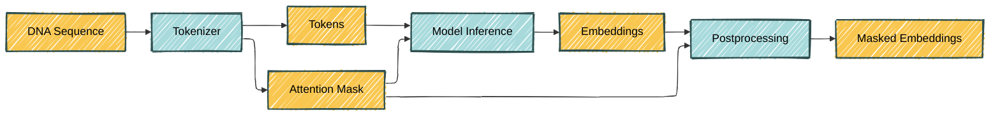

HuggingFace (🤗) has become a staple of LLM work. In this post I will explore this library with a different use case: handling DNA LLMs.

TODO What is inference

[HuggingFace's 🤗 `transformers`](https://huggingface.co/docs/transformers/index) is a powerful library for working with transformer models, providing a wide range of pre-trained models and utilities for fine-tuning and deploying them. Problem that is solved: different models have different APIs. The `transformers` library provides a unified API for all transformer models, making it easy to switch between them without having to learn a new API each time.

<!-- https://colab.research.google.com/github/hclimente/hclimente.github.io/blob/main/assets/python/2025-05-02-hf-transformers/main.ipynb -->

# The Nucleotide Transformer

I will focus on the [Nucleotide Transformer](https://www.nature.com/articles/s41592-024-02523-z), developed by [InstaDeep](https://www.instadeep.com/). InstaDeep shows a commendable commitment to open science, regularly publishing articles, models, documentation and code. In this article I use [a small, 50 million parameter Nucleotide Transformer](https://huggingface.co/InstaDeepAI/nucleotide-transformer-v2-50m-multi-species), available from [their 🤗 organization](https://huggingface.co/InstaDeepAI).

TODO The Nucleotide Transformer was produced by....



<div class="caption">
  Training of the Nucleotide Transformer using masked language modelling (MLM). Adapted from Figure 1 in the <a href="https://www.nature.com/articles/s41592-024-02523-z">Nucleotide Transformer article</a>.
</div>

TODO Describe inputs and outputs

# Loading a pre-trained model

For instance, fetching the Nucleotide Transformer adapted for masked language modeling is as easy as running:

```python
model = AutoModelForMaskedLM.from_pretrained(
  "InstaDeepAI/nucleotide-transformer-v2-50m-multi-species",
  trust_remote_code=True
)
```

This is facilitated by `AutoModelForMaskedLM`, one of the many [`transformers` AutoClasses](https://huggingface.co/docs/transformers/model_doc/auto).
TODO Elaborate

# Building an inference pipeline

The model cannot be applied directly to a DNA sequence. Usually, the workflow is:



[HuggingFace's 🤗 `pipelines`](https://huggingface.co/docs/transformers/pipeline_tutorial) exist to encapsulate these inference steps while cutting the boilerplate code.

TODO show code
TODO discuss some specific adaptations, e.g., attention masks

# Embedding DNA sequences

I will be using this model to embed protein-coding DNA sequences from six species: three animals (human, mouse and fruit fly); one plant (arabidopsis); one bacteria (_E. coli_); and one yeast (_S. cerevisae_).

To this end, I downloaded the DNA sequences of all protein coding genes for the selected species. For each species I randomly subsampled 2,000 sequences of 60 nucleotides each. Half of them were the train set, used for model building; the other half constituted the test set, used exclusively for performance evaluation. You can access the code [here](https://github.com/hclimente/hclimente.github.io/blob/main/assets/python/2025-05-02-hf-transformers/prepare_data.sh).

This is the UMAP of the embedded sequences:



Some disclaimers need to be made. First, I took a minuscule sample of all protein coding sequences, which is somewhat biased towards the beginning of the protein. Second, I am using the smallest Nucleotide Transformer, and its likely that larger models can represent these sequences more richly.

Even with these constraints, sequences from the same species tend to inhabit similar regions of the underlying manifold. If you are unconvinced, just squint your eyes. For those of you still unconvinced, I trained a muticlass logistic regression tasked with predicting the species using only the embeddings. This classifier achieved an accuracy of $$0.47$$, pretty good compared to the accuracy $$\frac 1 6 = 0.16$$ of the random choice. Furthermore, some of the errors are clearly between the most similar species: human and mouse.



# Fine-tuning the model

The Nucleotide Transformer has been trained via self-supervised learning, it's not too surprising that it can't separate different species right off the bat. Fine-tuning it to this task should provide more relevant representations. `transformers` 🤗 also provides an easy way of doing that using `transformers.Trainer`.

TODO Importing the model

TODO Fine-tuning

TODO Pipeline

TODO Improved embeddings

# Conclusions

TODO The role of HuggingFace's 🤗 in a ML stack
