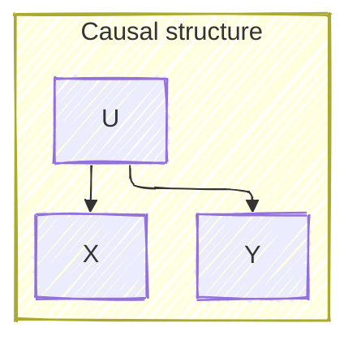

# Warm up

Let's start with some basic definitions. The **variance** of a random variable $$X$$ is defined as

$$
\sigma_X^2 = \mathbf{E}(X - \mathbf{E}(X))^2
$$

It takes values in $$(0, \infty)$$ that measures how disperse the outcomes of the RV are from its mean. Notably, the **(scalar) precision** is defined as $$\frac 1 \sigma_X$$.

The **covariance** between two random variables $$X_1$$ and $$X_2$$ is defined as:

$$
\text{Cov}(X_1, X_2) = \mathbf{E}((X_1 - \mathbf{E}(X_1))(X_2 - \mathbf{E}(X_2)))
$$

Note that if $$X_1 = X_2$$, $$\sigma_{X_1}^2 = \sigma_{X_2}^2 = \text{Cov}(X_1, X_2)$$.

It takes values in $$(-\sigma_{X_1} \sigma_{X_2}, \sigma_{X_1} \sigma_{X_2})$$ and measures the degree to which two random variables are linearly related. The **correlation** $$\rho$$ normalizes the covariance, taking it to the $$[-1, 1]$$ range:

$$
\rho_{X_1, X_2} = \frac {\text{Cov}(X_1, X_2)} {\sigma_{X_1} \sigma_{X_2}}
$$

The **covariance matrix** of a set of random variables ties these quantities together. If $$\mathbf{X}$$ is a column vector such that

$$
\mathbf{X} = \begin{pmatrix}
  X_1 \\
  X_2 \\
  \vdots \\
  X_n
\end{pmatrix}
$$

then the covariance matrix $$\mathbf{\Sigma}$$ is

$$
\mathbf{\Sigma} = \begin{pmatrix}
    \sigma_{X_1}^2        & \text{Cov}(X_1, X_2) & \cdots & \text{Cov}(X_1, X_n) \\
    \text{Cov}(X_2, X_1)  & \sigma_{X_2}^2       & \cdots & \text{Cov}(X_2, X_n) \\
    \vdots                & \vdots               & \ddots & \vdots               \\
    \text{Cov}(X_n, X_1)  & \text{Cov}(X_n, X_2) & \cdots & \sigma_{X_n}^2
\end{pmatrix}
$$

Since always $$\text{Cov}(X_i, X_j) = \text{Cov}(X_j, X_i)$$, $$\mathbf{\Sigma}$$ is _symmetric_. It is, in fact, _positive semi-definite_ ([proof](https://statproofbook.github.io/P/covmat-psd.html)).

By normalizing the covariance matrix by dividing item $$\mathbf{\Sigma}_{ij}$$ by $$\sigma_{X_i} \sigma_{X_j}$$, we obtain the **correlation matrix**:

$$
P = \begin{pmatrix}
    1               & \rho-{X_1, X_2} & \cdots & \rho-{X_1, X_n} \\
    \rho-{X_2, X_1}  & 1              & \cdots & \rho-{X_1, X_n} \\
    \vdots          & \vdots         & \ddots & \vdots         \\
    \rho-{X_n, X_1}  & \rho-{X_n, X_2} & \cdots & 1
\end{pmatrix}
$$

Finally, the **precision matrix** $$\mathbf{\Sigma}^{-1}$$ is the inverse of the covariance matrix, i.e., $$\mathbf{\Sigma} \mathbf{\Sigma}^{-1} = \mathbf{I}$$. Note that $$\mathbf{\Sigma}$$ is not guaranteed to be invertible, and hence $$\mathbf{\Sigma}^{-1}$$ might not exist. Let's ignore this case for now, and jump to where things start getting interesting. $$\mathbf{\Sigma}^{-1}$$ can be decomposed as follows:

$$
\mathbf{\Sigma}^{-1} =
U
\begin{pmatrix}
    1                                           & -\rho_{X_1, X_2 \mid X_3, \dots, X_n}          & \cdots & -\rho_{X_1, X_n \mid X_2, \cdots, X_{n-1}}      \\
    -\rho_{X_2, X_1 \mid X_3, \cdots, X_n}      & 1                                              & \cdots & -\rho_{X_2, X_n \mid X_1, X_3, \cdots, X_{n-1}} \\
    \vdots                                      & \vdots                                         & \ddots & \vdots                                          \\
    -\rho_{X_n, X_1 \mid X_2, \cdots, X_{n-1}}  & -\rho_{X_n, X_2 \mid X_1, X_3 \cdots, X_{n-1}} & \cdots & 1
\end{pmatrix}
U
$$

where $$U$$ is a normalization matrix:

$$
U =
\begin{pmatrix}
    \frac 1 {\sigma_{X_1 \mid X_2, \cdots, X_n}} &                                                   &        & 0 \\
                                                 & \frac 1 {\sigma_{X_2 \mid X_1, X_3, \cdots, X_n}} &        &   \\
                                                 &                                                   & \ddots &   \\
    0                                            &                                                   &        & \frac 1 {\sigma_{X_n \mid X_1, \cdots, X_{n-1}}}
\end{pmatrix}
$$

The entries $$-\rho_{X_., X_. \mid \dots}$$ in the middle matrix are **partial correlations**. Partial correlations quantify the correlation between two variables after removing the linear effects of the remaining variables. Partial correlations live in $$[-1, 1]$$.

# Partial correlations

Let's dive deeper into partial correlations. Let's imagine the following causal structure:

where

$$
U \sim N(0, 1)
$$

$$
X = U + \varepsilon_X
$$

$$
Y = U + \varepsilon_Y
$$

$$
\varepsilon_X, \varepsilon_Y \sim N(0, 0.25)
$$

These are the correlations and partial correlations of 200 random trios:



    <strong>Top row:</strong> original values. <strong>Bottom row:</strong> adjusted values.

Partial correlations correctly identify that $$U$$ is correlated to both $$X$$ and $$Y$$, and in turn that those are not correlated once we account for the effect of $$U$$. Note that while the true correlation between $$X$$ and $$U$$ is $$\rho_{X, U}$$, $$\rho_{X, U \mid Y} \neq \rho_{X, U}$$. This is because $$Y$$ contains an additional noise term that makes the adjustment imperfect.
